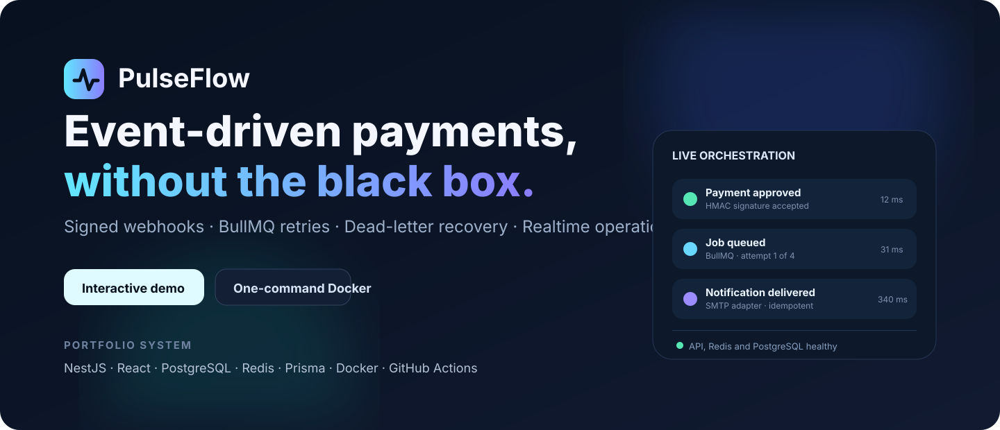
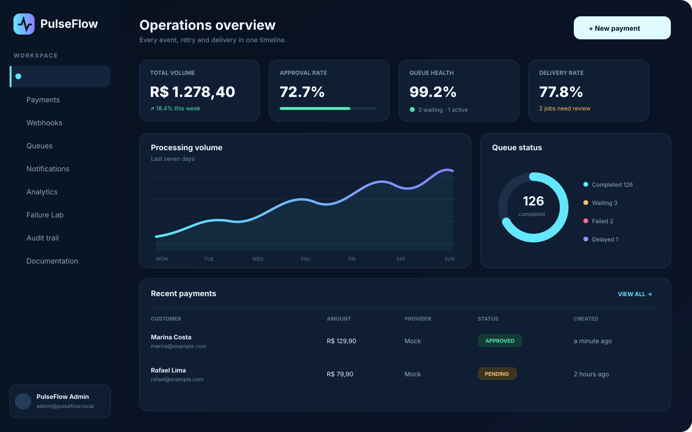
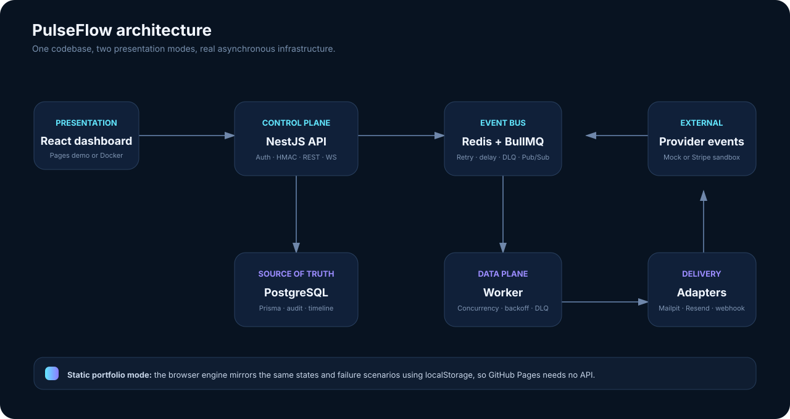

<p align="center">
  
</p>

<p align="center">
  <a href="https://github.com/drsklgfa/pulseflow/actions/workflows/ci.yml"></a>
  <a href="https://github.com/drsklgfa/pulseflow/actions/workflows/codeql.yml"></a>
  <a href="https://github.com/drsklgfa/pulseflow/actions/workflows/pages.yml"></a>
  
  
</p>

<p align="center">
  <strong>A portfolio-grade payment, signed-webhook, queue and notification orchestration platform.</strong><br />
  Run the real distributed stack with Docker, or explore the persistent browser demo hosted only by GitHub Pages.
</p>

<p align="center">
  <a href="https://drsklgfa.github.io/pulseflow/"><strong>Live interactive demo</strong></a>
  ·
  <a href="#quick-start"><strong>Run locally</strong></a>
  ·
  <a href="docs/ARCHITECTURE.md"><strong>Architecture</strong></a>
  ·
  <a href="http://localhost:3333/docs"><strong>OpenAPI</strong></a>
</p>

## Why PulseFlow exists

A checkout request is easy. Operating the events after that request is the hard part: duplicate webhooks, invalid signatures, unavailable providers, retries, timeouts, dead letters and missing traceability.

PulseFlow turns that hidden lifecycle into a visible product. Every state transition receives a correlation ID, every delivery attempt becomes part of an audit-friendly timeline, and every terminal failure can be inspected and safely retried.

This repository is deliberately **self-contained**:

- **Portfolio mode:** GitHub Pages runs a realistic, persistent browser engine with no server or paid account.
- **Full-stack mode:** one Docker Compose command starts the React dashboard, NestJS API, PostgreSQL, Redis/BullMQ worker and Mailpit inbox.
- **Provider mode:** adapters can switch from local mock/SMTP to Stripe and Resend through environment variables.

## Product preview

<p align="center">
  
</p>

### What can be demonstrated

| Capability | Portfolio demo | Docker stack |
| --- | :---: | :---: |
| Create and inspect payments | ✅ | ✅ |
| Approve or decline through provider events | ✅ | ✅ |
| Invalid-signature scenario | ✅ | ✅ |
| Retry and dead-letter scenarios | ✅ | ✅ |
| Persistent timeline and audit trail | ✅ localStorage | ✅ PostgreSQL |
| Real queue and worker concurrency | Simulated | ✅ Redis + BullMQ |
| Captured e-mail delivery | Simulated | ✅ Mailpit |
| Realtime updates | Browser events | ✅ Redis Pub/Sub + Socket.IO |
| Stripe and Resend adapters | Documented | ✅ Optional credentials |

## Architecture

<p align="center">
  
</p>

The monorepo separates the control plane from asynchronous execution:

```text
apps/web       React operations dashboard + standalone Pages demo
apps/api       NestJS REST/OpenAPI, authentication, signed webhooks and WebSocket gateway
apps/worker    BullMQ consumer, provider adapters, retries and dead-letter handling
packages/contracts  Shared domain, queue and security contracts
packages/database   Prisma schema, migrations, client and idempotent seed
```

Read the complete rationale in [Architecture](docs/ARCHITECTURE.md) and the decisions in [`docs/decisions`](docs/decisions).

## Quick start

### Requirements

- Docker Desktop with Docker Compose v2
- Git

No Stripe, Resend or cloud account is required.

```bash
 git clone https://github.com/drsklgfa/pulseflow.git
 cd pulseflow
 docker compose up --build
```

The default values are built into `compose.yaml`; copying `.env.example` is optional for the demo.

| Surface | URL | Purpose |
| --- | --- | --- |
| Dashboard | `http://localhost:3000` | Product UI and failure laboratory |
| API | `http://localhost:3333/api/v1` | Versioned REST API |
| Swagger | `http://localhost:3333/docs` | Interactive OpenAPI reference |
| Mailpit | `http://localhost:8025` | Captured local e-mails |
| Readiness | `http://localhost:3333/api/v1/health/ready` | PostgreSQL and Redis status |

Demo credentials:

```text
Email:    admin@pulseflow.local
Password: PulseFlow123!
```

These credentials are local fixtures only. Replace `AUTH_SECRET` and the bootstrap password before any public deployment.

### Stop or reset

```bash
# Stop services and preserve data
docker compose down

# Remove containers and local volumes
docker compose down -v --remove-orphans
```


### Publish the visual demo on GitHub Pages

After the first push, activate the repository-level Pages setting and dispatch the included workflow with one command:

```powershell
powershell -ExecutionPolicy Bypass -File .\scripts\enable-github-pages.ps1
```

The `Deploy interactive demo to GitHub Pages` workflow then republishes the visual portfolio automatically whenever the web application changes on `main`. See [GitHub Pages deployment](docs/GITHUB_PAGES.md).

## Explore the main workflow

1. Sign in and create a pending payment.
2. Open **Failure Lab**.
3. Select the payment and trigger approval, decline, one transient failure, permanent failure or timeout.
4. Watch the payment timeline, queue metrics and notification state update.
5. Open Mailpit for successfully delivered messages.
6. Retry a dead-letter notification from the operations UI.

The mock provider still exercises the real database, signature verification, queue, worker and audit logic. Only the external network call is replaced.

## Security and reliability highlights

- Scrypt password hashing and signed, expiring access tokens
- Role-based authorization for administrative mutations
- HMAC webhook validation, timestamp validation for Stripe and replay protection
- Database and queue idempotency keys
- Request correlation IDs and immutable processing events
- Rate limiting, strict DTO validation and security headers
- Exponential retry policy, terminal failure persistence and dead-letter queue
- Non-root Node.js runtime containers with graceful shutdown
- CodeQL, Dependabot and dependency review workflows
- Secrets excluded from source control and logs

See [Security](SECURITY.md) and the [threat model](docs/SECURITY_MODEL.md).

## Quality gates

The CI pipeline provisions real PostgreSQL and Redis service containers, then runs:

```text
repository validation
→ Prisma generation and migrations
→ deterministic seed
→ strict TypeScript checks
→ unit tests and coverage
→ API integration tests
→ production builds
→ Docker Compose validation
```

Additional workflows publish the GitHub Pages demo, scan JavaScript/TypeScript with CodeQL, review dependency changes and package tagged releases. The Pages build detects the repository path automatically, so forks and renamed repositories keep valid asset URLs.

Useful commands when developing without Docker:

```bash
npm install
npm run prisma:generate
npm run prisma:deploy
npm run prisma:seed
npm run typecheck
npm run test:coverage
npm run test:integration
npm run build
```

## Optional real providers

The local mode is the default. To connect external sandbox services, set:

```env
PAYMENT_PROVIDER=stripe
STRIPE_SECRET_KEY=...
STRIPE_WEBHOOK_SECRET=...

NOTIFICATION_PROVIDER=resend
RESEND_API_KEY=...
RESEND_FROM=PulseFlow <verified@your-domain.example>
```

Provider details and safe rollout steps are in [Provider configuration](docs/guides/PROVIDERS.md).

## Documentation map

- [Start here](START_HERE.md)
- [Architecture](docs/ARCHITECTURE.md)
- [API and event flows](docs/API.md)
- [Testing strategy](docs/TESTING.md)
- [Operations runbook](docs/RUNBOOK.md)
- [Security model](docs/SECURITY_MODEL.md)
- [Deployment options](docs/DEPLOYMENT.md)
- [Portfolio walkthrough](docs/DEMO.md)
- [Restore and verification](RESTORE.md)
- [Release history](CHANGELOG.md)

## Scope

PulseFlow is an educational portfolio system, not a certified payment processor. It intentionally avoids storing card data and delegates real payment collection to provider-hosted APIs. Production adoption still requires organization-specific compliance, monitoring, backup, privacy and incident-response reviews.

## License

Released under the [MIT License](LICENSE).
