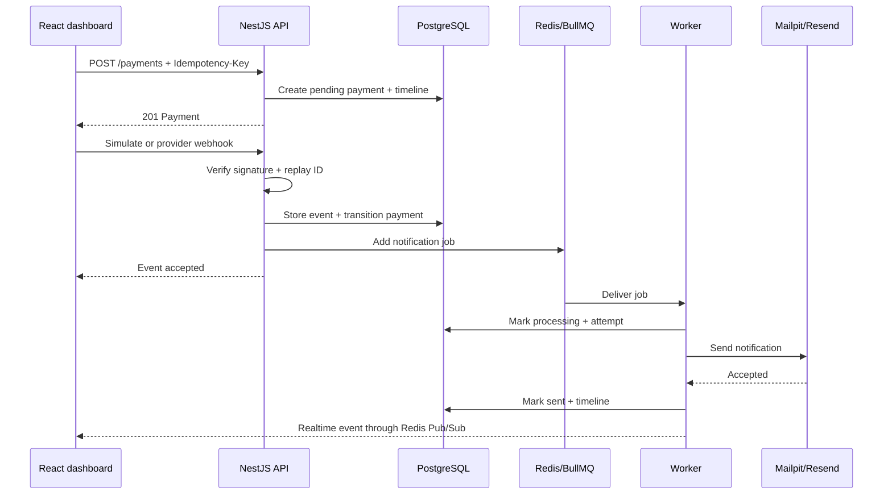

# Architecture

## Goals

PulseFlow is designed to demonstrate a production-minded event-driven workflow while remaining easy to evaluate from a public GitHub repository.

The architecture optimizes for:

1. reliable processing after the HTTP request has returned;
2. visible, auditable state transitions;
3. local execution without paid providers;
4. replaceable external integrations;
5. deterministic automated validation;
6. a static portfolio experience when no backend is running.

## System boundaries

### React web application

The dashboard is an operations console, not a checkout form. It consumes the versioned API and receives realtime events through Socket.IO. When compiled with `VITE_DEMO_MODE=true`, the same interface delegates to a local browser engine that persists state in `localStorage`.

### NestJS API

The API is the control plane. Its responsibilities are:

- authenticate users and enforce roles;
- validate input and rate limits;
- create idempotent payment orchestration records;
- verify webhook signatures and reject replays;
- apply valid payment-state transitions;
- publish notification jobs;
- expose dashboards, analytics and audit data;
- fan out realtime events through Redis Pub/Sub.

The API does not send e-mail directly. That keeps latency and provider failures outside the request path.

### PostgreSQL

PostgreSQL is the source of truth for users, payments, webhook events, notifications, immutable processing events and audit logs. Important idempotency boundaries have database uniqueness constraints:

- `Payment.idempotencyKey`;
- `Payment.externalId`;
- `WebhookEvent.externalEventId`;
- `Notification.queueJobId`.

### Redis and BullMQ

Redis provides:

- the notification job queue;
- delayed exponential retries;
- dead-letter storage;
- queue metrics;
- Pub/Sub transport for realtime UI events.

BullMQ job IDs reuse the notification identifier where possible, creating another idempotency barrier.

### Worker

The worker is independently scalable. It loads the notification and related payment, records the attempt, renders the template, calls the selected provider and writes the final state. Failures remain observable and terminal failures are copied to the dead-letter queue.

### Provider adapters

Payment and notification integrations are hidden behind small interfaces:

```text
PaymentProvider
├── MockPaymentProvider
└── StripePaymentProvider

NotificationProvider
├── MockProvider
├── SmtpProvider (Mailpit locally)
└── ResendProvider
```

The mock mode is not a fake UI shortcut. It replaces only the external network boundary; persistence, signature validation, queueing and worker execution remain real in Docker mode.

## Core event flow



## State machines

### Payment

```text
PENDING ──▶ APPROVED
    ├─────▶ DECLINED
    └─────▶ CANCELLED
```

Terminal states do not transition again. Duplicate provider events are acknowledged without repeating side effects.

### Notification

```text
PENDING ──▶ PROCESSING ──▶ SENT
                 │
                 └──▶ PENDING (retry)
                         │
                         └──▶ FAILED ──▶ manual retry
```

## Failure semantics

- **Transient failure:** BullMQ retries with exponential backoff.
- **Permanent failure:** all attempts are persisted, then copied to dead letter.
- **Timeout laboratory:** introduces a provider delay and deterministic failure.
- **Duplicate webhook:** returns an idempotent duplicate result.
- **Invalid signature:** stores a rejected event and returns HTTP 401.
- **Unmatched provider event:** stores the event for operations review without changing a payment.

## Security boundaries

The browser never receives provider secrets. Card data is never collected or stored. Public provider endpoints use raw request bytes for signature verification. Administrative mutations require an authenticated `ADMIN` role. See [Security model](SECURITY_MODEL.md).

## Scaling path

The API and worker are stateless apart from external data stores. A production deployment can run multiple API replicas and increase worker replicas/concurrency. PostgreSQL uniqueness constraints and deterministic job IDs preserve exactly-once business effects on top of at-least-once delivery.

## Static demo trade-off

GitHub Pages cannot run Node.js, PostgreSQL or Redis. The portfolio build therefore embeds a browser engine that mirrors domain states and error scenarios. The UI marks this as Demo Mode. The full infrastructure remains available through Docker and is validated separately by CI.
